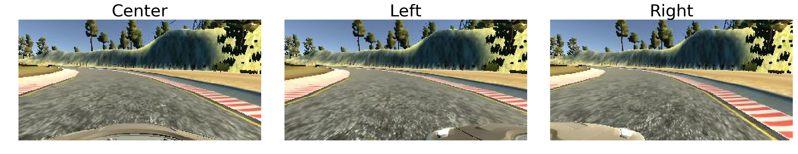

# **Behavioral Cloning** 

## **Objective**
This project describes the usage of a convolutional neural network in Keras to predict steering angles from images. The neural network can be trained to 'clone' our behavior of driving a car and staying in the middle of the lane.

## **Neural Network Overview**

**Dataset**

  

To obtain sufficient dataset for training and validation set for the neural network, the following are performed:

* Drive one lap around the loop in the middle of the lane, to encourage the network to drive the car in the middle of the lane.
* Drive one lap around the loop in the opposite direction, to remove directional bias in steering angle due to the loop or driver's behavior.
* Drive from the sides of the lane to the middle for one lap, to allow the network to correct the car when deviated from the lane.
* Drive smoothly around the corners for one lap, to encourage the network to drive the car smoothly when turning.

The dataset has the following properties:

* The size of training set is 11842.
* The shape of a traffic sign image is 160 x 323 x 3 (RGB format).
* The steering angles range from -1 (left) to 1 (right).

**Pre-processing**

There are four pre-processing steps being done on the dataset:

1. Usage of images from left and right cameras. To increase the size of the dataset, images from left and right cameras are used along with those from the center cameras. The steering angles associated with the images from left and right cameras are increased and decreased by a constant value respectively. This is because the images from the left and right cameras are treated as images from the center camera by the network. This step triples the dataset.

2. Usage of flipped images. To generalize the dataset, flipped images from the dataset are used. This step will remove directional bias of steering angle due to the closed loop or the behavior of the driver. This step doubles the dataset.

4. Normalization of images. To allow the network to converge faster, the RGB pixel intensity is normalized to between -1 and 1.

4. Usage of cropped images. To allow the network to train better, the images are cropped from the top and bottom to remove any unnecessary portions that do not contribute to predicting the steering angles such as the sky and the hood of the car.

Here is an example showing the difference between the images from the center, left and right cameras.

  

Here is an example showing the difference between the original image and flipped image.

  

Here is an example showing the difference between the original image and cropped image.

  

**Network Layers**

The neural network is consisted of the following layers:

| Layer                 |Description                                                    | 
|:---------------------:|:-------------------------------------------------------------:| 
| Input                 | 160x320x3 RGB image                                           | 
| Normalization         |                                                               | 
| Cropping              | outputs 90x320x3                                              | 
| Convolution 5x5       | 5x5 kernel, 2x2 stride, valid padding, outputs 43x158x3       |
| RELU                  |                                                               |
| Convolution 5x5       | 5x5 kernel, 2x2 stride, valid padding, outputs 20x77x24       |
| RELU                  |                                                               |
| Convolution 5x5       | 5x5 kernel, 2x2 stride, valid padding, outputs 8x37x36        |
| RELU                  |                                                               |
| Convolution 3x3       | 3x3 kernel, 1x1 stride, valid padding, outputs 6x35x48        |
| RELU                  |                                                               |
| Convolution 3x3       | 3x3 kernel, 1x1 stride, valid padding, outputs 4x33x64        |
| RELU                  |                                                               |
| Flatten               | outputs 8448                                                  |
| Fully connected       | outputs 1164                                                  |
| RELU                  |                                                               |
| Fully connected       | outputs 100                                                   |
| RELU                  |                                                               |
| Fully connected       | outputs 50                                                    |
| RELU                  |                                                               |
| Fully connected       | outputs 10                                                    |
| RELU                  |                                                               |
| Fully connected       | outputs 1                                                     |
| Output                | steering angle                                                |

The model architecture is based on Nvidia's PilotNet, as shown below:

  

**Hyper-parameters**

The following hyper-parameters are used to train the model:

* Epochs: 5
* Batch size: 12

The model is using Adam optimizer to minimize loss function.

**Results**

The following graph shows the training and validation error with respect to the epochs. Since the validation error is only slighly higher than the training error, suggesting no overfitting. The training and validation error is low, suggesting no underfitting. Therefore, no modification is done onto the model architecture, such as inserting dropout or maxpooling layers.

  

The following video shows the network driving the car by outputting appropriate steering angles given images from the center cameras:

  

